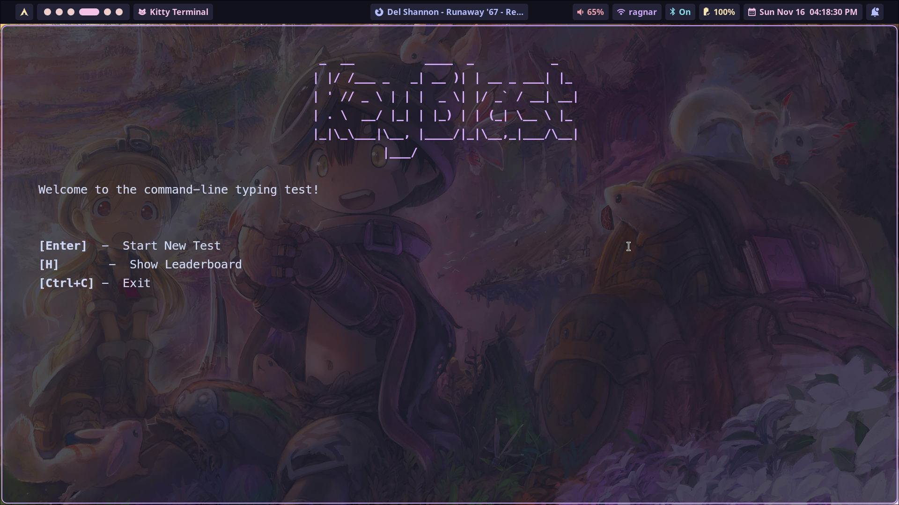
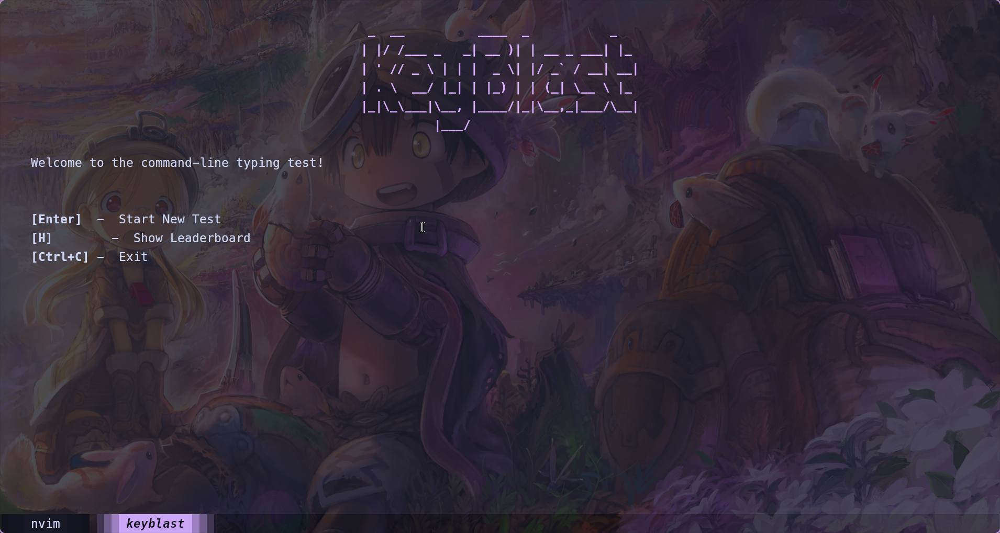
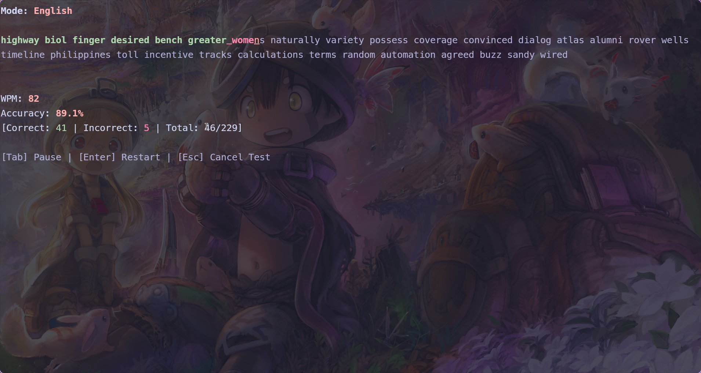

# **KeyBlast**

**A minimal, responsive, and fast Bash CLI typing test simulator.**

KeyBlast is a lightweight terminal typing trainer supporting English words, JavaScript syntax, and C++ syntax.
Designed for Linux terminals with real-time WPM, accuracy updates, live highlighting, and a clean UI.

<!-- paste this into your README.md where you want the gallery -->
<div style="display:flex;flex-wrap:wrap;gap:8px;margin:12px 0;">
  
  
  
  
</div>

---

## **Features**

- Real-time WPM + accuracy
- English, JavaScript, and C++ wordlists

---

## **Prerequisites**

Your script uses the following tools:

| Tool                         | Why it's needed             |
| ---------------------------- | --------------------------- |
| **zsh/bash**                      | Script runtime              |
| **bc**                       | WPM + accuracy calculations |
| **curl** or **wget**         | Downloading wordlists       |
| **figlet**                   | Big text banners            |
| **tput**                     | Terminal sizing             |
| **Nerd Fonts (recommended)** | Cleaner icons/spacing       |

**Arch Linux install** (as i use arch)

```bash
#replace paru with yay acc to ur preference
paru -S zsh bc curl figlet   #or yay -S zsh bc curl figlet
paru -S ttf-jetbrains-mono-nerd   #or yay -S nerd-fonts-meslo

```

ask gpt for ur distro alternative comands :)

---

## **Installation**

```bash
git clone https://github.com/dotbillu/KeyBlast
cd KeyBlast
./install.sh
```

This installs the `keyblast` command globally.

---

## **Run**

```bash
keyblast
```

Boom — typing test starts.
Use it whenever you’re bored or wanna warm up your fingers.

---

**Licensed under the MIT License — free to use, modify, and distribute.**
